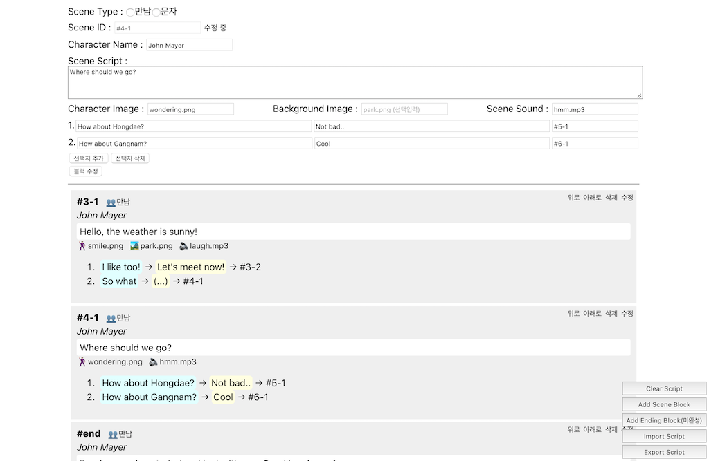

# Game Script Tool

## 

## 개요

스토리 기반 스크립트를 자기위한 툴입니다. React로 제작하였으며 Scene을 Block 단위로 작성합니다. 파일로 Import / Export하여 데이터를 관리할 수 있고, 각 장면마다 출력된 배경이미지, 인물이미지, 사운드파일 및 대화내용, 선택지를 작성할 수 있습니다. 작성된 스크립트는 JSON 텍스트로 출력되며 확장자(.txt) 파일로 출력됩니다.

## 스크린샷

